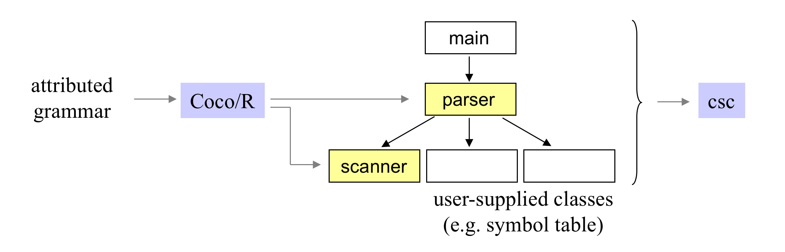

### Coco/R

#### ¿Qué es Coco/R?
Un generador de compiladores que aceptan una gramática (BNF) de un lenguaje (antes
definido) y genera un scanner y parser para ese lenguaje.

Por ejemplo, una gramática de Bison que antes tuvo un tokenizador de Flex puede
ser extendido para tener un compilador en Coco/R.

El scanner de Coco/R funciona como un automáta determinístico finito. Mientras
que el parser utiliza descenso recursivo.

#### Cómo funciona Coco/R

